# Good practice for coding

When writing code to solve science problems it is very easy to aim to do \*just\* enough to get the answer you need.  It always feels like the fastest thing to do at the time, and at the time it may well be.  Unfortunately, what usually happens is the problem you started solving presents new problems, and they present new problems, and the code you started with then gets added to, and added to, and added to, to solve all these extra problems.  The result is that your original 'quick and dirty' code becomes your 'long, slow, un-readable, fragile mess' code.  You then find that you have to spent more and more time debugging it and trying to remember exactly what all the different parts do.

The other problem is that you may find that you code is in fact quite useful and you may want to share it with collaborators or students (or your future self) but unfortunately as it's a 'long, slow, un-readable, fragile mess' no-one else can understand any of it, let alone make it work, and they end up having to write their own 'long, slow, un-readable, fragile messes' to duplicate yours.

This is certainly the experience I had with my own code which is now over 50,000 lines long and comprises 29 different executables of which only about 12 still work.  So, with with the benefit of hindsight, the goal of this section is to help you to write code that is readable and maintainable. And, once you have solved what you need to solve, can be shared with the world with your head held high.  The key goal is to ensure that you avoid all the pain I have experienced in the past (and continue to experience in the present).

The first thing I need to teach you is the fundamental rule of writing code:

- You will often do very, very stupid things

My worst was typing `rm *` then, when going for the shift to add `.out` to remove my output files, instead bumped `enter` irreversibly deleting my entire code base. On a smaller scale you will often find that when coding you will sometimes convert working code to broken code and you won't know why and you won't be able to get it back to how it was (this will happen a lot).

Therefore the most important part of good coding practice is:

## Version Control

In its simplest form version control takes snapshots of your code at different stages and saves it so you can wind back to earlier versions if a problem arises.  It also allows you to branch your code so you can try new approaches while leaving the original version safe.  Finally it allows multiple people to work on a given code at the same time and for them to resolve the conflicts that arise when they edit the same files.

### Git

In this course we will introduce you to `git` (there are others, but git is an industry standard and used widely, ~70%). `git` is a distributed and decentralised version control system created by Linus Torvalds, the creator of Linux, to manage the development of the Linux kernel.  It was initially created to automate his previous approach to version control which was to take `diff`s between versions of his code and to email them to himself (remember that the output of `diff` is a set of instructions for converting one file into another). He could then use `patch` to move between different versions of his code at different times.

Git has some key advantages:

-   You can run it locally on your desktop just for yourself (You will want to make sure this is a machine that has a backup service)
-   Or you can upload you repository to a git hosting site like github, bitbucket and gitlab.  The University Information Service (UIS) also has git repositories you can access.  This makes it easy for a team to work on the code and also gives you a very important off-site backup in case your laptop dies.
- Git will scale to just about any size you can think of (sometimes needs a small extra effort)
- Using git opens door to industrial best practices and peer-to-peer software ideas

One thing to consider when choosing a hosting site is data protection.  If you are working with sensitive data, or projects, you may want your repository to be private. This can be done on all the above options.  Github now allows private repositories on free accounts for everyone. Bitbucket also allows unlimited private repositories for small teams. Gitlab allows local hosting  https://git.maths.cam.ac.uk/users/sign_in and the UIS service is naturally Cambridge only https://git.uis.cam.ac.uk/x/maths/.

Before we get into the detail, let's see `git` works in simple cases

### Creating a repository

One you have some code in a directory that works (optional!) you will want to create a git repository to keep track of changes (you can of course do this before you start a project).  You create a git instance from the terminal window with: 

```
cd directory_with_project
git init
```

Now if you type `ls -a` you will see a hidden directory called '.git'. This is your and where the snapshots if your code are keep in what is called a repository.  At the moment there are no files in it so let's add some:

```
git add 'list of files and directories'
```

Note: as a general rule you should only add files you have actually typed.  
So not: 
- compiled executables
- libraries
- object files
- \*.pyc
- editor backup files
- data  
This command doesn't actually add them to the repository it just tells git that these are files we need to keep track of. We can check what has happened with:

```
git status
```

This will tell us that there are no files committed to branch master and a list of new files to be included. If you are working on some code that creates a bunch of executables and output files (stuff you shouldn't track by git), the output might get cluttered by them (marked as "untracked") making it harder to see the important stuff. 

To avoid that, you should create a file called `.gitignore` (make sure you can see "hidden files") and add to it all the extensions you would like to exclude from tracking. You can also add folders to it.  You should add this file to the `git` repo and only include files in it, if you think no-one who uses it will want to track them.  If you have manually added tracking for a file then this will override gitignore (so you could solve your problems by putting `*` in `.gitignore` then adding everything manually, but this is not good practice).  

The format is simply to list all the files/patterns you want to ignore using the globbing wildcards. For example `*.out` will ignore all files which end in `.out` in this folder, and all sub-folders. To ignore directories you need specify `dir\` which will not track the directory or anything in it, (but will track files called `dir`).  To ignore files in a directory but not ones in sub-directories use `\filename`.  Standard templates exist for most languages, check here:
https://github.com/github/gitignore

while `.gitignore` in each repository is used automatically, you can create a global one to be used for all repositories with 
```
git config --global core.excludesfile ~/Python.gitignore
```

Now, if we are happy with the files we have added to `git` we can commit them to the repository with:

```
git commit -m 'Descriptive message here saying what you have done'
```

If you omit the -m git brings up an editor where you can write a much longer note **which you should probably do most of the time** as what makes sense to you now won't make sense to you in 2 years time. Git will complain the first time you do this as your name and email are not known. To set them use:

```
git config --global user.name "Wilberforce Velociraptor Norton"
git config --global user.email wvn99@cam.ac.uk
```

You may also want to specify the editor that git opens for typing commit messages using:

```
git config --global core.editor name_of_editor
```

When you write your commit messages, do not get in the habit of writing ones like this:


Most importantly don't just say what you have done, but say **why** you did it.  You **will** forget, so make sure you have enough detail for someone new to the project to understand what changed.  Here is the standard style guide for commit messages (this is a commercial one for when many people work on the project):

```
Summarize changes in around 50 characters or less

More detailed explanatory text, if necessary. Wrap it to about 72
characters or so. In some contexts, the first line is treated as the
subject of the commit and the rest of the text as the body. The
blank line separating the summary from the body is critical (unless
you omit the body entirely); various tools like `log`, `shortlog`
and `rebase` can get confused if you run the two together.

Explain the problem that this commit is solving. Focus on why you
are making this change as opposed to how (the code explains that).
Are there side effects or other unintuitive consequences of this
change? Here's the place to explain them.

Further paragraphs come after blank lines.

 - Bullet points are okay, too

 - Typically a hyphen or asterisk is used for the bullet, preceded
   by a single space, with blank lines in between, but conventions
   vary here

If you use an issue tracker, put references to them at the bottom,
like this:

Resolves: #123
See also: #456, #789
```

If you have made a mistake with your commit, like forgetting a file, you can fix this using `--amend` which is preferable to adding many small commits in a short space of time. It is done like this:

```
git commit -m 'initial commit'
git add forgotten_file
git commit --amend
```

Ideally, you should always add files manually one by one to know exactly what you are going to commit, but sometimes you might have been working on too many files (for example, you changed a global variable name in a big c project) or maybe you are just sure your `.gitignore` file is configured correctly and you are working on your own repository anyway, so it won't be too bad if you accidentally add something wrong to it, then you can just use an "add all" command to save typing time: `git add -A`.  


You can check the history of the project with:

```
git log
```

This is the basic cycle for one person using git.  You edit some code, once you are happy with it, you add, then commit the changes, then edit some more. You should think of git as having three areas that it keeps track of.

1. Working directory
2. Staging area
3. Committed

Files start in 1, the working directory where you can edit/create them. When you are happy with your work you use `git add` to tag that are ready for being committed. Now they are in 2, staging.  Once all the files you want are in staging you take a snapshot of them with `git commit` which makes a `hash` of the files that have changed in the repo and hides it in the `.git` folder.  Now you go back to editing which moves the files back to 1.

***
Technical aside:  Why does git not store diff files?  Previous version control systems, like SVN, did store a sequence of diff files but this is computational expensive to apply many patches to move back and forth.  Git instead keeps new copies of all files that have changed each time.  This seems wasteful but when projects grow git creates `pack` files of similar objects, and uses compression to remove duplication of information, so the final size is the same (or smaller) than storing the diff files but with increased performance.
***

Again, this should only really be for your code you typed yourself. If you to add large data sets then the repository can become very large and checking what had changed between commits becomes much more difficult.  These should be stored with your usual backups (which you should also definitely have). You can use `git` for things like python notebooks of mathematica files but this is sub optimal as these contain a lot of information on the current state and output of various cells which is of no interest and hard to understand if you view the `diff` files to understand what has changed.

If you find that you have made a terrible mistake in a file but haven't committed it yet, you can return to the last committed version of that file with:

```
git checkout -- 'filename'
```

This will revert to the last committed version of that file, this will work even if you deleted the file in question.  

If you want all changes removed, use `git checkout .` (Note: if you are not in the root folder it will only remove changes from folders down from where you are).  

All these commands have multiple options you can add using `-` just like in `BASH`.  To learn more about any of the commands use:

```
git help 'command'
```

Git keeps track of all your commits with something called a Directed Acyclic Graph (DAG) which defines the order the commits were made (simply by giving each commit an `parent`). A typical example for early in development would be something like this:

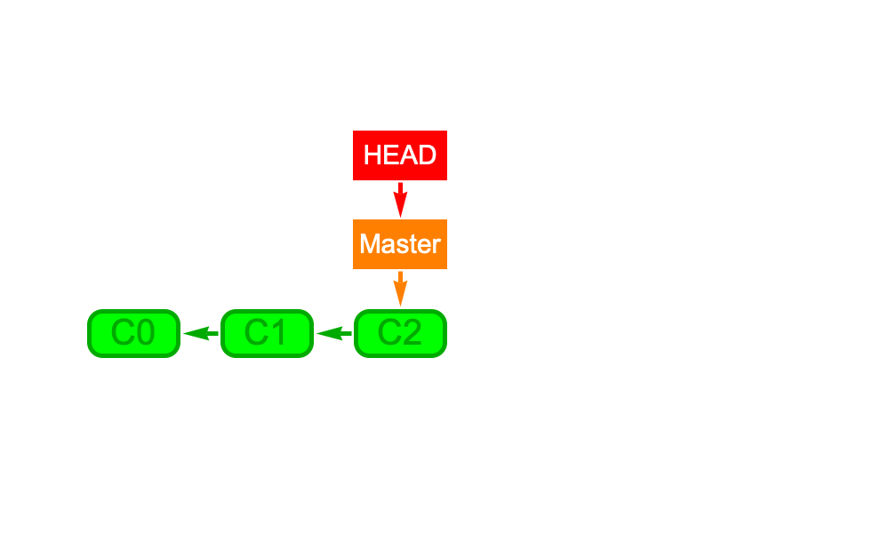

Here we see that we have made 3 commits (C0, C1, C2) and there are two labels, "HEAD" and "Master" which point to the last commit, C2.  The "Master" label is labeling the part of the graph and the "HEAD" label is labeling where the commit that is currently active.

Now let's consider the option where you have broken you code but didn't notice until you had already committed it. Now you want to back to an earlier version. You do this with:

```
git reset HEAD~
```

This will wind you back one commit (`HEAD~n` winds back n commits). It comes with three options, `--soft`, `--mixed`, and `--hard`.  The `--soft` option means that we go back to just before the commit.  `--mixed` mean go back to before the commit and undo all the `add`'s. `--hard` means go back to just after the last commit, before anything was edited. Commits further down the DAG will still exist for a while (~30 days) so nothing is lost immediately, but will eventually get cleaned up and deleted. To go back we need to where we were do `git reset HEAD@{1}` which means reset to the previous place `HEAD` pointed to (`HEAD@{n}` goes to the place head pointed to n steps ago). Here is what it looks like after a reset

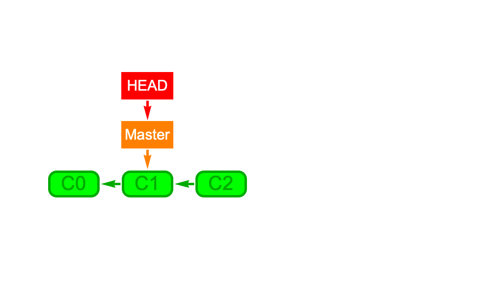

Now we see that all that has changed is that the labels have both moved to the commit C1.

You should only use this if you genuinely want to undo changes.  If you just want to look at the previous commit you should use `git checkout @{1}`, then `git checkout master` will return you to where you were.  To go anywhere in the DAG you just need to use the SHA-1 (Secure Hash Algorithm) hash of the commit as the label. This is the long string after the word "commit" when using `git log` then use `git checkout 'SHA-1'`. Git will understand any unique shortening of this so you don't have to type it all.  To get a list of unique shortened codes use `git log --abbrev-commit` instead.

There is a complication with checking out specific commits like this.  The issue is that this moves just the "HEAD" label, but not the "Master" label which is described as a 'detached' state.  When `HEAD` no longer points to `master` (or another branch name), if you try to commit, the commit won't belong on any named part of the graph.  

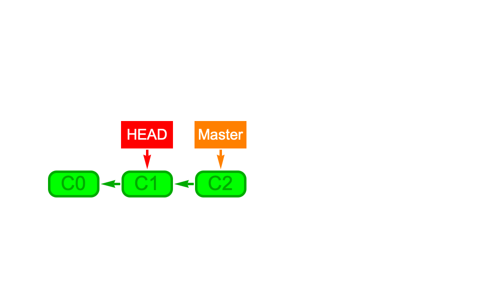

This can all be a bit confusing to navigate so there are many GUI clients which help visualise the DAG.  Part of the standard install will be gitk (on mac you will have to do install it yourself) or you can use a third party option: https://git-scm.com/downloads/guis/, many of which allow you to manage all of git rather than just view it.  

You should note that checking out other commits would delete any uncommitted changes in you current space. Luckily by default git refuses to perform checkout to different branch if it would result in lose of uncommitted changes, you can override this by using `-f`. 

If you want to go look at another commit when you are in the middle of something that isn't ready to be committed, but don't want to lose your work so far, then you can save you progress with:

```
git stash
```

This takes all you edits and saves them in a kind of "secret commit", you are now safe to checkout any other commits.  You can view your current stashes with `git stash list` and bring them back with `git stash apply`.  You can even do this somewhere different from where you stashed it.  This is useful if you start work on the wrong branch and want to move your work elsewhere.

If you just want to compare two different commits you don't need to check them out at all.  You just use:

```
git diff 'commit1' 'commit2'
```

`diff` can also compare individual files, or even branches.

The next thing you might want to do is try developing a new feature, or changing the way some part is calculated, while keeping the original production code as it is for safe keeping.  To do this you create a `branch`:

```
git branch 'sensible and descriptive branch name usually with "-" or "_" instead of spaces'
```

This creates the branch, which currently is just a label `branch`, but doesn't actually move you to it, you will still be on `master`.

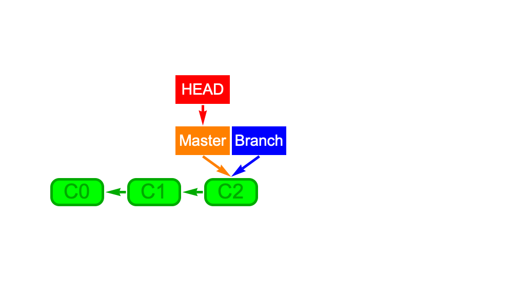

You do this with the `checkout` command. To switch between branches you type:

```
git checkout master # switch to main
git checkout branch # switch to new
```

Or you can add the `-b` option to the branch creation command which combines creation with switching to the new branch.

Note: You can use branches to avoid creating a detached state when you checkout an earlier commit by defining this commit as a new branch  by using `git checkout -b branchname SHA-1`.  This will more you to that commit but also create a branch label pointing to this commit.

After creating the branch the DAG looks like this (assuming we went back to C2 beforehand).


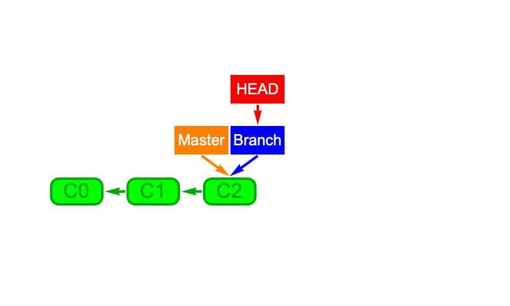
So switching between `master` and `branch` does nothing but move `HEAD`.  

Suppose you continue to work on the branch, and make two more commits.  The DAG will now look like this:

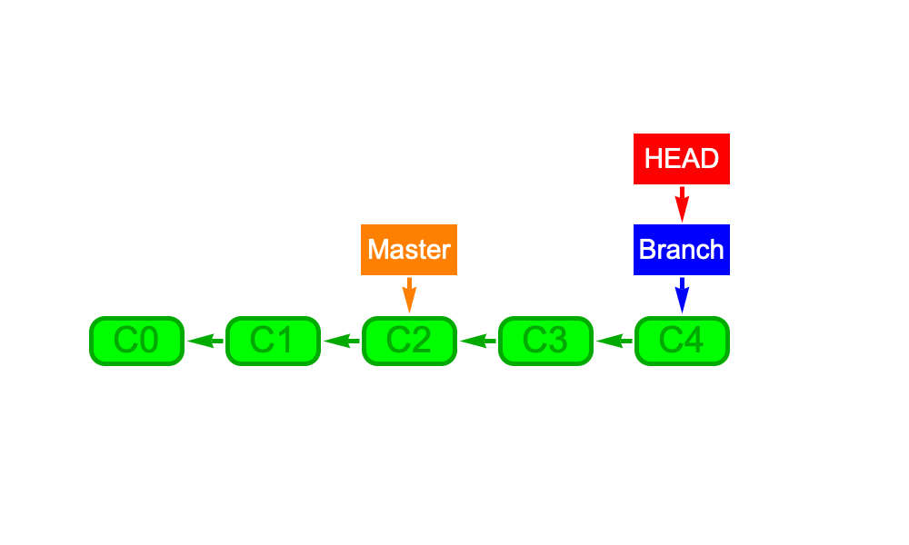

At any time you are free to edit and commit to both `master` or `branch` and git will keep everything separate.  Switching between the `branch` and `master` will cause git to change all the files in your directories to those associated with the last commit on each (by applying relevant diff files).  If we are happy with our new feature, we may want to add it to the `master` version.  To do this we would perform a `merge`:

```
git checkout master
git merge branch
```

This changes back to the last commit on the `master` branch and then merges it with the last commit on the `branch` branch.  As there are no places where the graph splits between the two, we can just move the label `master` to point to the commit C4

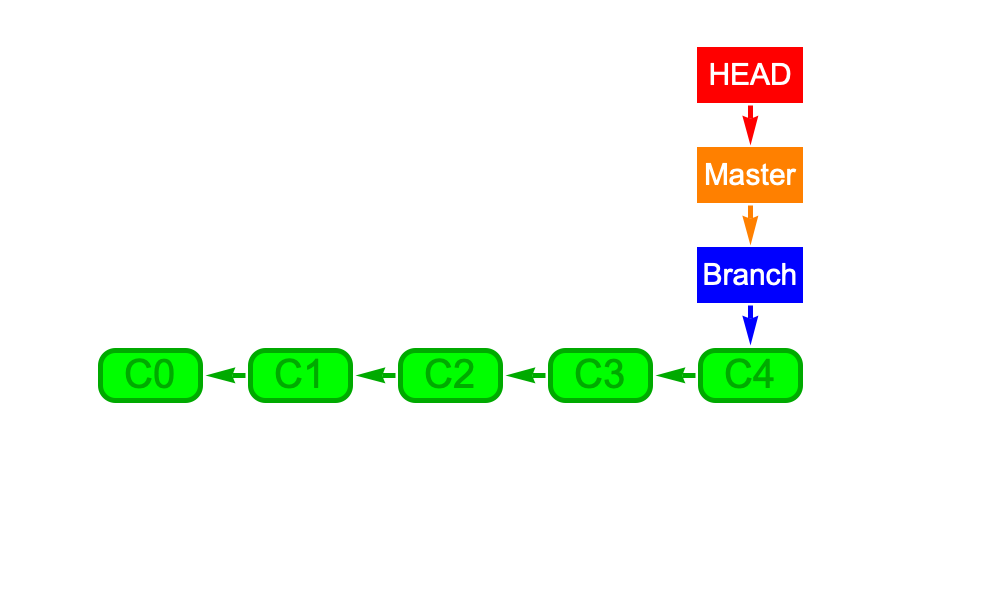

This is known as a 'fast-forward' commit because git does not have to do any thinking in order to do it as it is just moving labels.  After it the `merge` we can then delete the branch with `git branch -d 'branch name'` which removes the `branch` label.

Now suppose instead of doing this you (or a collaborator) had switched back to master and made one more commit.  Now the DAG would look like this:

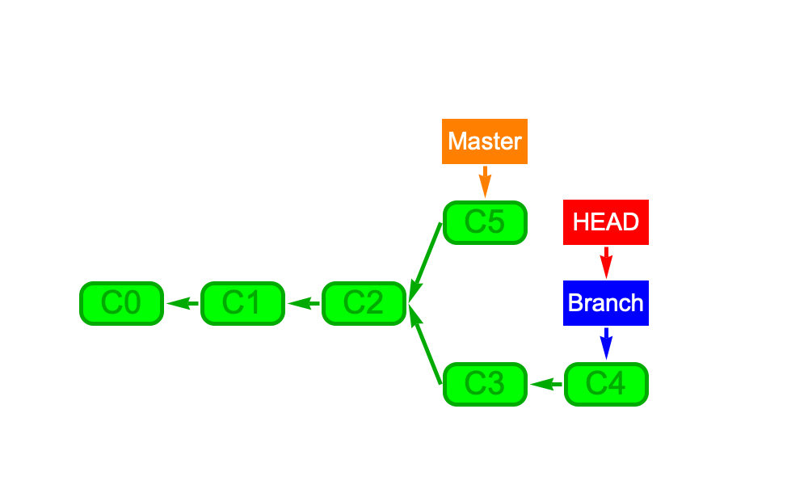

So `HEAD` would point  to C5 when we are on `master` and C4 when we are on `branch`. 

Now what happens when you try to merge? If we use the same commands as before we would change to the `master` then merge the commit that `branch` points to, C4, with the one `master` points to, C5, to make a new one C6.

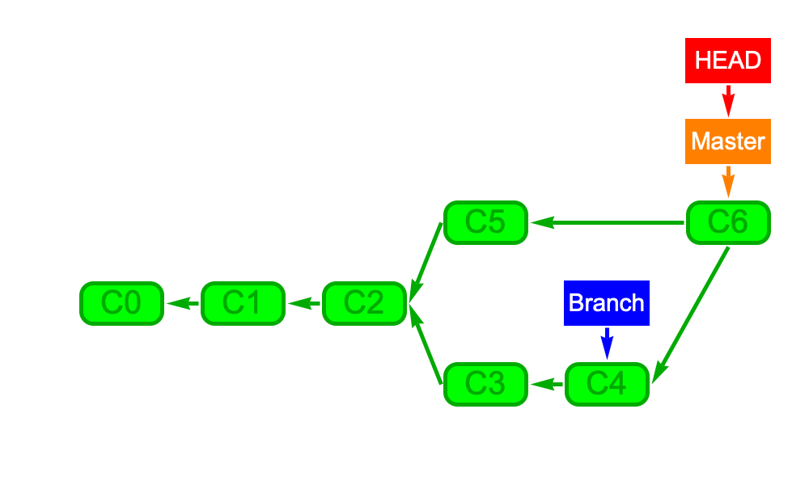

This may not be straight forward. The same file may have been edited differently in C5 and C4 so git will be unsure which version we want to keep when merging.  When this happens you get the message: "Automatic merge failed; fix conflicts and then commit the result."  To see what happened you can use `git status` which will list the files which have problems.  If you then open one of these files you will see which sections conflict as they will have been marked with code that looks like this:

```
<<<<<<< HEAD:filename.py
'the code in the file on master'
=======
'the code in the file on branch'
>>>>>>> branch:filename.py
```

You then have to go into each file and replace each of these sections with what you think the code should really say.  Once you have done this you should `add` the file to staging.  Once all files have been `add`ed then you should run `git status` to check all conflicts are gone then `git commit` to complete the merge.  After this we are free to delete the branch with `git branch -d 'branch name'`.

Unfortunately git will only raise issues if the two commits being have merged have edited the same file differently.  This doesn't mean that your code will still work.  

You could have made an <b>evil merge</b>.  This occurs in the following example when you try to merge the following two commits: 
    
- Added extra argument to function in branch1
- Used function somewhere new in branch2

The merge is fine as the files edited in each commit do not overlap, but the code is now broken!  unfortunately, there are many ways that this can happen so there is no way to avoid this.  git works purely by taking `diff`s between files that have been edited, so will not pick up anything that is not visible to this simple command.  This means that you still have to **think** when working on your code, particularly if you are part of a team.

This is generally avoided by using many branched then merging them together and running robust tests which the code must pass before merging the changes back to master which should be viewed as the "release" version of the code and be fiercely protected.


### Git on remote repositories

So far we have only looked at what happens locally when we have a single user, now we will look at the case when you are writing code collaboratively.  Here git is essential for managing conflicts associated with multiple people working on the same files simultaneously.  To do this, generally we need to put a `master` version of the git repository somewhere everyone in the collaboration can see, either a local server or a git hosting service like github, https://github.com, or https://bitbucket.org.

Once the master repository is somewhere everyone can see it, we need to make a local copy for us to work on (ideally no-one should work on the master but this is perfectly possible, you can have a system with no central repository and you just send changes to each other directly but this can be tricky).  To create our local repository use:

```
git clone 'repository to clone'
```

This creates a local version of the repository for us to work on. You can actually create a empty repository with a default readme file on github and clone that when you are starting a new project, or create a local repository and connecting it to one on github using `git remote add origin <REMOTE_URL>`. 

Now we have two commands to manage interaction with the remote repository, `fetch` and `push`.

Unless you have just cloned the repository, the first thing you should do before starting work is:

```
git fetch origin
```

This gets a new copy of the remote repository (we can leave out `origin` as it defaults to this anyway). Next we have to merge it with ours using `git merge origin/master`, checking for conflicts.  Once these are resolved, we are ready to start with everything up to date. Ideally, you should look what you are going to merge to avoid weird accidents, but in practice, it's often convenient to replace those two commands by one - `pull`. So you can just type `git pull origin master` and it will perform a fetch and merge for you.  This will fail if there are conflicts and you will have to go back to `fetch` then `merge`


Now we follow all the same steps as above edit->add->commit.  Once we are done with our changes, we can merge them to the remote repository with:

```
git push origin master
```

Provided no-one has edited the same files while we were working on, this will merge our changes with the remote repository.  If it fails because of conflicts then we will have to do a `fetch` and `merge` (or `pull`) then try again.  `push` will only allow fast-forward of conflict free merges.

### Forks

Sometimes you might want to work on a project based on someone's else public code, but not actually be a part of their development team. For example, you might want a copy of your professor's repository, but with your own personal notes/solutions added. 

There is no command to "fork" a repository, it is just a name we give to the practice of making a separate copy of a repository.  Github has a button to "fork the repository" which creates a copy of the public repository in your personal space.  Alternatively you can just use the clone command and delete the remote connection.  

It is possible to create a forked copy of a repository that can pull from the original but you can push to your own version.  This allows you to take advantage of updates to the public repository but keeping the modifications you have created.  Be warned, as you are trying to keep two separate repositories in sync, this can be a headache unless you are careful.

To do this by cloning the original then adding a second remote address to your branch with 

```
git remote add MYREMOTENAME MYFORKADDRESS
```

This will allow you to get all the updated code with 

```
git pull origin master
```

and add your own stuff to your fork with

```
git push MYREMOTENAME master
```

### Git style guides

So that is the basic commands for using GIT, but this does not tell us **how** we should use it. What should your workflow look like?  Some people just use git like this:


But it can pay to think about the workflow model you want to use, here we will look at a few.

The simplest is to have a branch master and a branch development. You always work on development until you are happy with the code then do a fast-forward merge to bring master up to development then continue editing on development. Do not use this unless your project is really small and you are working alone, otherwise you might get lost in your changes.  One habit that I really like is to think in terms of "releases"  where you create branches which label particular commits related to specific events, like the publishing of a paper.  This allows you to go back to the exact code used for specific analyses and repeat them if questions come up later from reviewers or other academics using you work.  This also support open science by making you work reproducible by others.

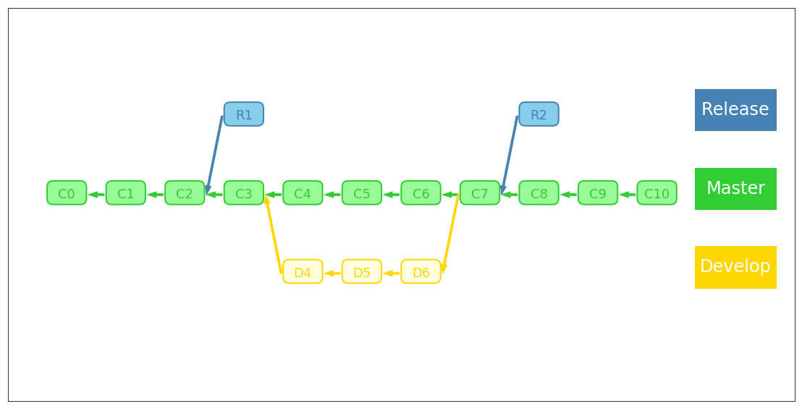

If you have a larger team then you should use git flow.  Here each person works on their own development branch, and creating their own testing branches for testing any new features.  Once each person has a stable correct version, they merge their code back to the master, and everyone else can pull these changes back to their branch. In larger teams they may just push back to their groups branch with mergers to main handled by group leaders.

Actually, it's considered a bad practice to ever make commits to the master branch directly, instead you push our code to your branch then create a "pull request" which indicates that you would like to merge this commit to the master branch.  This can then be reviewed by the development team before being approved to merge to the master which generally can only be done by senior developers.  We will come back to this again in subsequent lectures. This is what you should get used to if you ever envision yourself working as a software developer. 

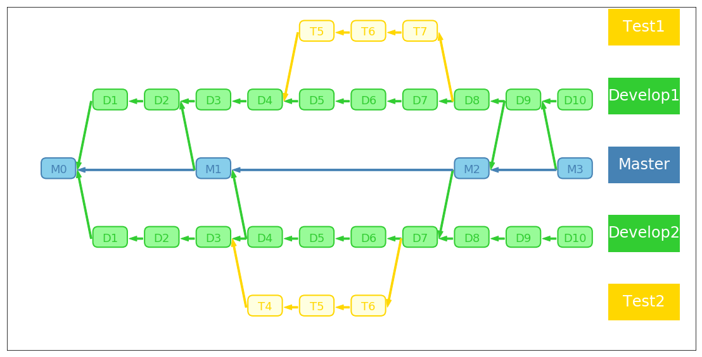 

### Git internals (for fun*)

How does git work?  Lets build a git repo and check it out.  If we create a folder then cd into it and type `git init`.  This creates a new folder called `.git` with the following contents:

```bash
description
HEAD
config
- refs
  - heads
  - tags
- objects
  - pack
  - info
- info
  exclude
- hooks
  applypatch-msg.sample		
  commit-msg.sample		
  fsmonitor-watchman.sample	
  post-update.sample		
  pre-applypatch.sample		
  pre-commit.sample		
  pre-merge-commit.sample
  pre-push.sample
  pre-rebase.sample
  pre-receive.sample
  prepare-commit-msg.sample
  push-to-checkout.sample
  update.sample
```
This is the (semi-)minimal set of folders and files for a git repo. `description` is used by web front-ends to provide a name and description of the repository. `HEAD` is a reference to the current commit we are in. `config` contains basic configuration information for the repo. The folder `refs` contains the names of branches and tags and where they point to (i.e. files that just have the hashes of specific commits). `info` contains additional information for the repo, `exclude` covers files to exclude from git like your `gitignore` file. `hooks` contains customization shell scripts which can be connected to the use of various git commands.  The folder contains many samples for illustration.  To "turn them on" you just remove the `.sample` from the end.  These can be used to set-up continuous integration or other restrictions before actions can be taken.

`objects` is where all your commits end up and `pack` is populated with pack files of similar files.  To see this lets create a file called greet.txt, add the word hello to it then add the file:

```bash
$ echo "Hello" > greet.txt
```

We will now have an additional file in `.git` called `index` (which is the information the git status returns) and a new folder in objects called `e9` with a file called `65047ad7c57865823c7d992b1d046ea66edf78`.  This is the SHA-1 hash of the file `greet.txt` where git has split of the first two letters to make a directory (for faster searching in large projects)  This file is in binary form (called a `blob` for **b**inary **l**arge **ob**ject) but we can read it with the git utility (from outside the folder):
```bash
$ git cat-file -p e965047ad7c57865823c7d992b1d046ea66edf78
Hello
```
We can create a commit with:
```bash
$git commit -m "initial commit"
```
now we will see that `index`, `objects` have both been updated and we have a new file: `COMMIT_EDITMSG` which contains the commit message you just entered, and a folder `logs` which contains a history of all your branches.  In objects we have two new blobs, one "tree" object which covers all the files in the commit, and one which lists the commit info and points to the blob with the tree (and parent commit, if it exists). We can read all of these with `git cat-file -p` to see what they say and understand what is happening. We can create the `DAG` tracing the list of parents in each commit for each branch.

Further "reading"
https://www.youtube.com/watch?v=ADvD-DfSTSU


